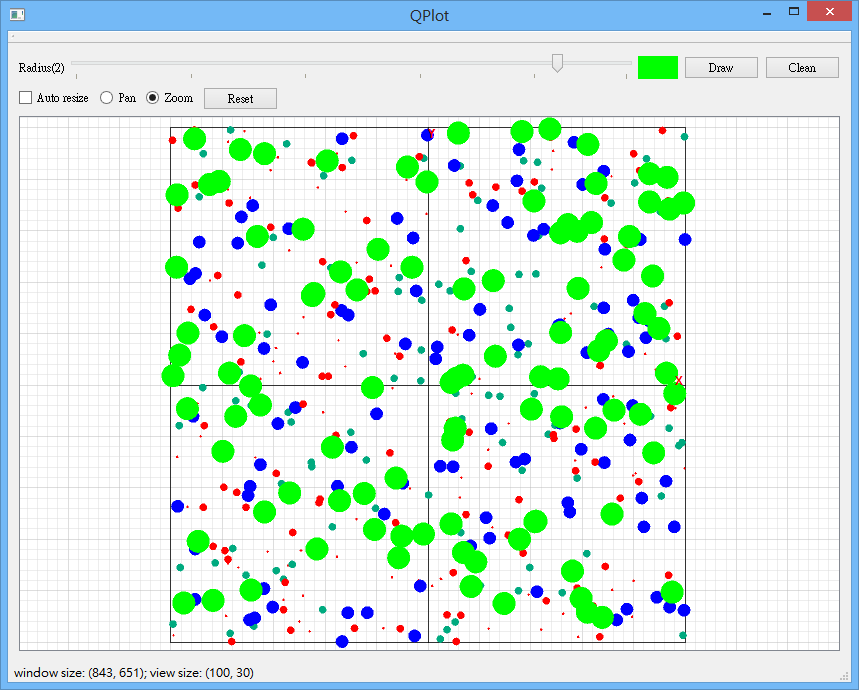

qplot-example
=============

An example to show you how to use Qt's Graphics View framework to implement a
plot-like application.

This example show you
---------------------

- How to use QGraphicsScene to draw background and foreground.
- How to group items.
- How to resize scene.
- How to fit view to the items in scene.
- How to draw text on foreground of scene and the text won't be scaled acoording
  to view's transformation.

How to build it
---------------------
- Open src/qplot.pro by Qt Creator.
- Press build button.
- Run!

> **NOTE** this program is built with Qt 5.4. However, it should be compatible
> with Qt4 and Qt5.
